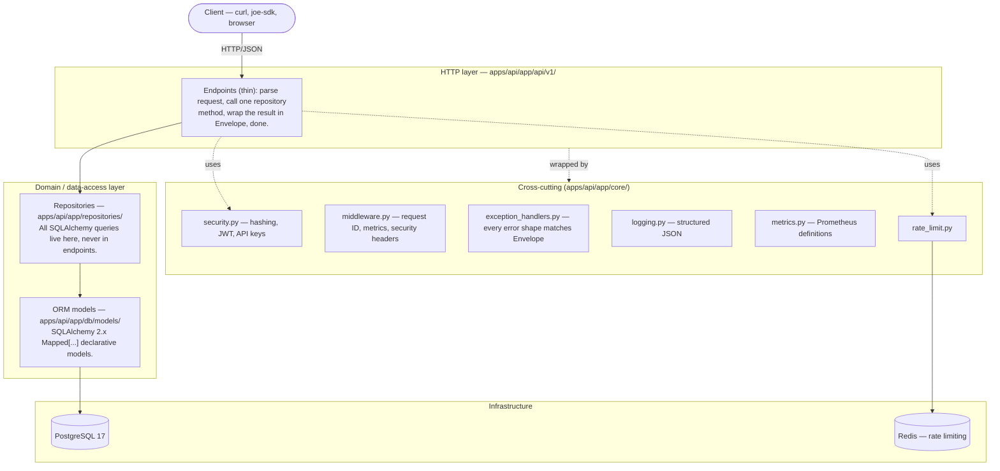

# Architecture

## Layering

This is **not** full Clean Architecture with a separate framework-agnostic
domain-entity layer — SQLAlchemy models double as the domain layer. For a
platform this size, a parallel set of plain-dataclass domain entities plus
a mapping layer between them and the ORM models would be pure duplication
with no behavioral payoff yet. Repositories are the actual architectural
boundary that matters here: **endpoints never import SQLAlchemy**, so
swapping how a query is written, adding caching, or moving a read to a
replica touches one file, not every route that happens to need that data.
If a second persistence backend or a genuinely complex domain model ever
shows up, promoting repositories' return types from ORM objects to real
domain entities is a contained refactor — the seam is already there.

## Request lifecycle

1. **Middleware** (outermost to innermost, matching `main.py`'s
   registration order reversed — see that file's comments):
   `CORSMiddleware` → `SecurityHeadersMiddleware` → `MetricsMiddleware` →
   `RequestIDMiddleware` → routing.
2. **Routing** matches method + path to an endpoint function in
   `api/v1/*.py`.
3. **Dependency injection** resolves, in order: a request-scoped
   `AsyncSession` (`get_db_session`, which also owns the
   commit-on-success/rollback-on-exception transaction boundary for the
   whole request — see that function's docstring for why this is
   centralized rather than repeated per-endpoint), then a repository
   wrapping that session, then — for protected endpoints — the
   authenticated `User` via `get_current_user` (JWT bearer *or*
   `X-API-Key`, whichever is present) and optionally a permission check
   via `require_permission(...)`.
4. **The endpoint** calls one or two repository methods, assembles a
   response schema, and returns it wrapped in `Envelope[...]`.
5. **On the way out**, any raised `HTTPException` /
   `RequestValidationError` / unhandled `Exception` is caught by
   `core/exception_handlers.py` and reshaped into `ErrorEnvelope` — every
   response, success or failure, matches the same top-level contract.

## The trust layer, architecturally

The platform's entire value proposition — verified facts, not invented
ones — lives in exactly two tables: `Source` and `Verification` (see
`docs/er-diagram.md`). Every fact-bearing entity (`Service`, `Fee`,
`Requirement`, `Document`, `Agency`, `Office`) can have zero or more
`Verification` rows attached via a polymorphic `(entity_type, entity_id)`
pair rather than a dedicated join table per entity type. This is a
deliberate DRY-over-referential-integrity tradeoff: the database can't
enforce that `entity_id` points at a real row (there's no single table a
foreign key could name), so that guarantee is the repository layer's job
instead — see `KnowledgeRepository`'s module docstring.

## Why a monorepo

`apps/api` is the only thing that actually runs today. `services/*` are
scaffolded-but-empty directories for when a piece of this genuinely needs
to be independently deployable — nothing has hit that threshold yet, and
splitting prematurely would mean paying inter-service network calls and
deployment complexity for zero present benefit. `packages/sdk-python`
(built, Milestone 7) and `packages/sdk-js` (still a stub) are already
correctly separate: they're distribution artifacts for third-party
developers, never imported by `apps/api`, regardless of living in the same
git repository.

## Async throughout

SQLAlchemy 2.x async engine + `asyncpg`, FastAPI's native `async def`
endpoints, `httpx.AsyncClient` in both the test suite and the SDK. The one
place this requires real discipline: every relationship an endpoint reads
must be eagerly loaded (`selectinload`) by the repository method that
fetched it, or SQLAlchemy raises `MissingGreenlet` on first access — there
is no implicit lazy-loading fallback in async mode the way there is
under the sync ORM. This has been the single most common bug class caught
during this project's milestone-end reviews (see individual milestone
commit messages) — worth knowing about before adding a new endpoint that
reads a relationship no existing query already loads.

## What's deliberately not built yet

- **Full domain-object CRUD.** Only `Service`/`Requirement`/`Fee` have
  write endpoints (Milestone 4). `Agency`/`Law`/`Document` CRUD is a
  natural extension of the same pattern, deferred until a second real use
  case exists to design it against.
- **Semantic/vector search.** `GET /v1/search` (Milestone 5) is PostgreSQL
  full-text search (`tsvector`/`ts_rank`), not the `OpenSearch`/`pgvector`
  layer in the original tech stack — lexical search covers the CAC use
  case; semantic search is a real but separate investment.
- **Background jobs.** `celery`/`RabbitMQ` are in the dependency list and
  `docker-compose.yml` respectively, but nothing produces or consumes a
  queue yet — no milestone has needed one.
- **Terraform / cloud infra.** Everything so far runs via Docker Compose
  for local development; the `infrastructure/terraform/` directory is
  still an empty scaffold.
