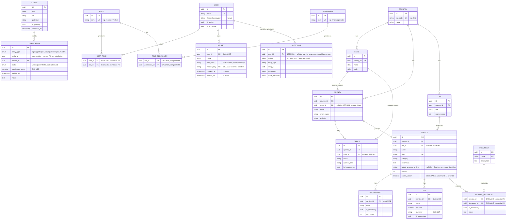

# Entity Relationship Diagram

Generated by hand from `apps/api/app/db/models/*.py` — not auto-generated,
so if the models change, this file needs a matching edit. It's checked
against the actual model definitions (field names, nullability, FK
`ondelete` behavior) as of Milestone 7, not just described from memory.

Three domains, three files: `geography.py` (countries/states + the trust
layer), `knowledge.py` (the actual answerable content), `auth.py` (users/
RBAC/API keys/audit). All share one `Base` and one Alembic migration
history, but the module split mirrors this diagram's groupings.

## Notes on deliberate deviations from a "textbook" schema

**`Verification` is polymorphic, not six separate join tables.** `entity_type`
+ `entity_id` identify the fact being verified (a `Service`, `Fee`,
`Requirement`, `Document`, `Agency`, or `Office`), rather than
`service_verifications`, `fee_verifications`, etc. each duplicating
identical columns and query logic. The real cost: the database itself
cannot enforce that `entity_id` points at a row that actually exists in
whichever table `entity_type` names — there's no single table a foreign
key could reference. Repositories are responsible for only ever writing
valid `(entity_type, entity_id)` pairs (see
`app/repositories/knowledge_repository.py`'s module docstring).

**`Document` is shared across services, not owned by one.** The same
document type ("a valid means of ID") is required by many services;
`ServiceDocument` (an association *object*, not a bare many-to-many table)
carries the per-service `is_mandatory`/`notes` that differ by context.

**`Fee` is its own entity**, not folded into `Requirement` — an explicit
decision confirmed with the project owner before Milestone 2, since fees
and process-steps are different kinds of fact even though both attach to
a `Service`.

**No `Country`/`Agency`/`User` delete endpoints exist yet** — but every
one-to-many relationship that *would* be affected by one already has
`passive_deletes=True` set (see `knowledge.py`/`geography.py`/`auth.py`),
deferring cascade behavior to the database's `ON DELETE` rules rather than
SQLAlchemy's default (and, for `NOT NULL` child columns, broken) attempt
to null out foreign keys in Python first. Fixed proactively in Milestone 4
after the identical bug surfaced in `Service`'s child relationships — see
that milestone's commit for the full explanation.
