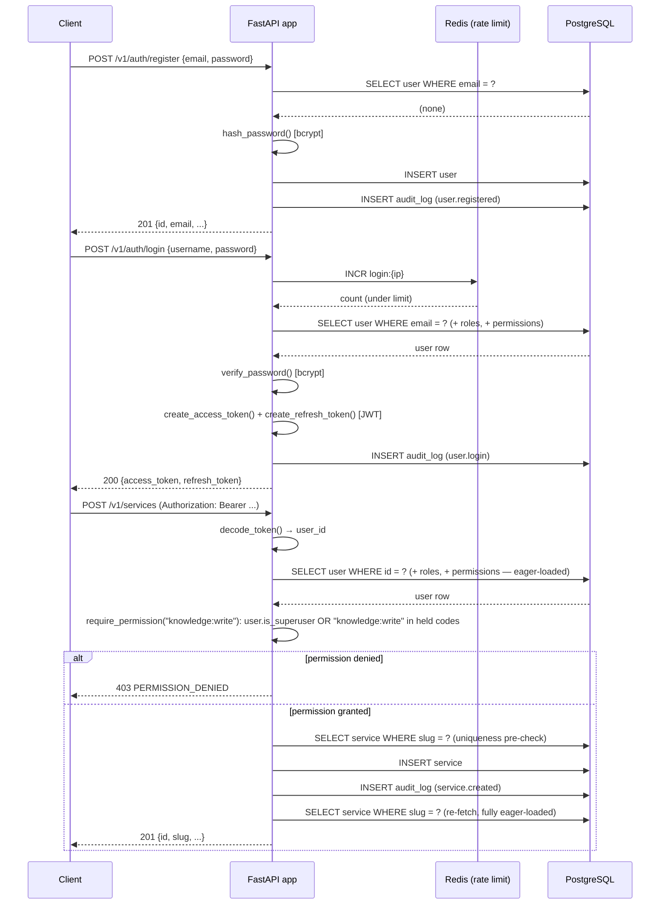
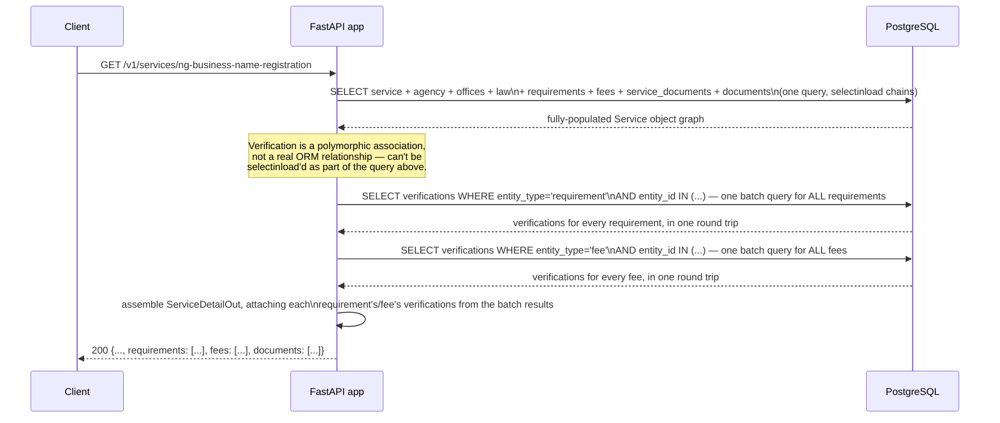
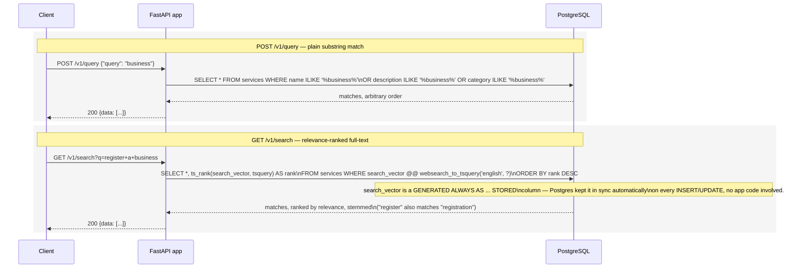

# Sequence Diagrams

Three flows chosen because each exercises a different architectural
concern that isn't obvious from reading a single file in isolation.

## 1. Register → login → authenticated write

Shows the JWT issuance/verification path and where `require_permission`
actually sits in the request lifecycle relative to authentication.

**Why the re-fetch after insert, instead of returning the object just
created:** the freshly-inserted `Service` object doesn't have its
`agency`/`law` relationships loaded — touching them to build the response
would trigger an async lazy-load, which raises (`MissingGreenlet`) rather
than quietly working the way it might under the sync ORM. Re-fetching
through the same fully-eager-loaded query every other read uses is simpler
than maintaining a second, partial loading path just for the
just-created case.

## 2. `GET /v1/services/{slug}` — assembling the trust layer

Shows why this endpoint issues more than one query despite returning a
single JSON object, and why that's not an N+1 problem.

Three or four queries total, regardless of how many requirements or fees
the service has — the two verification lookups are batched (`entity_id IN
(...)`) rather than issued once per requirement/per fee in a loop, which
is the actual N+1 pattern this design avoids.

## 3. Full-text search — why two endpoints exist for "search"

